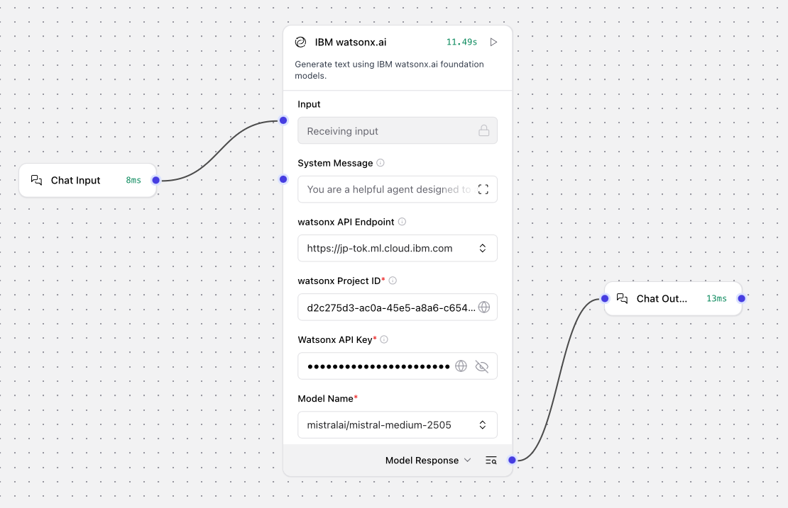
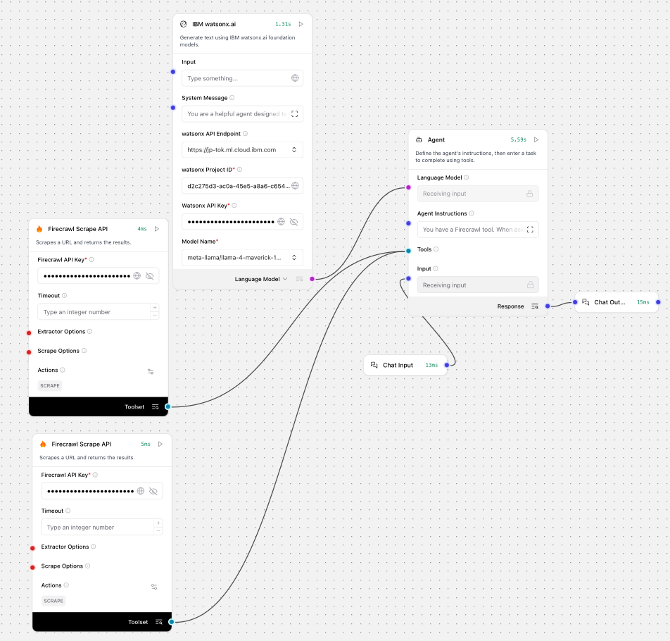
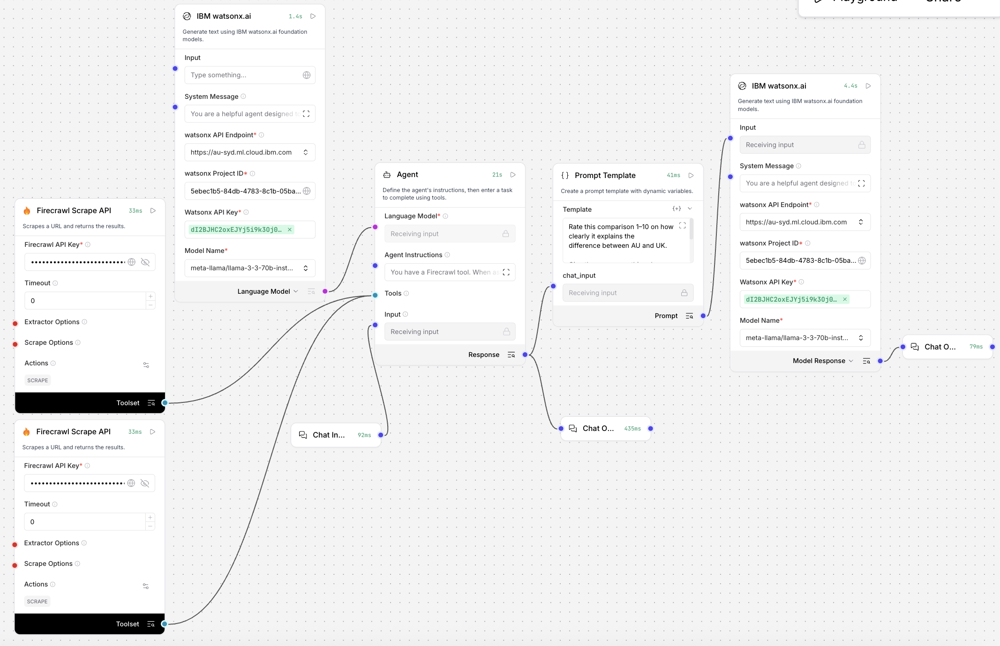

# Chapter 2: Visual Agent Development with Langflow

Welcome to Chapter 2! Here we'll explore **low-code visual agent development** using Langflow - the perfect middle ground between no-code simplicity and full programming control. You'll build an agent that compares Australian and UK skills priorities live from official government sources, then have a second LLM judge the quality of the comparison.

<!-- VIDEO PLACEHOLDER: Intro-Langflow — re-insert video embed here -->

## Learning Objectives

By the end of this chapter, you'll be able to:
- Set up and navigate the Langflow visual interface
- Build basic chatbots using IBM watsonx.ai models
- Create agentic workflows with Firecrawl tool integration
- Implement the LLM-as-judge pattern for automated quality evaluation
- Deploy and test your visual agent workflows

## What is Langflow?

Langflow is a visual framework for building multi-agent and RAG applications. It provides:
- **Drag-and-drop interface** for creating AI workflows
- **Pre-built components** for common AI tasks
- **Visual debugging** to see data flow between components
- **Easy deployment** of your completed workflows
- **Integration** with multiple LLM providers and vector databases

## Setup Instructions

Getting started with Langflow is straightforward:

### Option 1: DataStax Trial (Recommended)

1. **Sign up for a Langflow Trial via the DataStax Website**:
   ```
   https://astra.datastax.com/signup?type=langflow
   ```

2. **Access Langflow**:
   ```
   https://astra.datastax.com/langflow
   ```

3. **Start building** your first flow!

### Option 2: Local Installation

If you prefer to run Langflow locally:

```bash
pip install langflow
langflow run
```

Then open your browser to `http://localhost:7860`

## The Use Case: AU vs UK Skills Comparison

By the end of the lab your flow will look like this:

```
Chat Input
    │
    ▼
Agent (watsonx.ai / Mistral-Large)
    ├── Firecrawl AU ──► scrapes JSA skills shortage page
    └── Firecrawl UK ──► scrapes UK priority skills page
    │
    ▼ Agent's comparison response
Evaluation Prompt
    │
    ▼
Second LLM (watsonx.ai / Mistral-Large)
    │
    ▼
Chat Output
```

| Firecrawl | Country | URL |
|---|---|---|
| Firecrawl 1 | 🇦🇺 Australia | `https://www.jobsandskills.gov.au/publications/towards-national-jobs-and-skills-roadmap-summary/current-skills-shortages` |
| Firecrawl 2 | 🇬🇧 UK | `https://www.gov.uk/government/publications/assessment-of-priority-skills-to-2030/assessment-of-priority-skills-to-2030` |

**What each page contains:**
- **AU — JSA Current Skills Shortages:** shortage rates by occupation group, the four shortage types (Longer Training Gap / Shorter Training Gap / Suitability Gap / Retention Gap), Top 20 occupations in demand, regional barriers, and wage analysis
- **UK — Assessment of Priority Skills to 2030:** employment in priority occupations growing from 5.9M to 6.7M by 2030, largest demand in Care Workers (+90,000) and Programmers/Software Developers (+87,000), ten priority sectors, and qualification-level breakdowns

## Course Exercises

### Exercise A: Basic Prompting

<!-- VIDEO PLACEHOLDER: Langflow1-Basic — re-insert video embed here -->

First up, we'll create a simple chatbot with no tools - this establishes the groundwork for more complex agents.


*Basic prompting workflow showing Chat Input → IBM watsonx.ai → Chat Output*

**System Prompt**:
```
You are a helpful agent designed to assist with user queries.
```

**Nodes Required**:
- **Chat Input** - Receives user messages
- **IBM watsonx.ai** - Language model for processing
- **Chat Output** - Displays agent responses

**Workflow Setup**:
1. Add a Chat Input component
2. Connect it to IBM watsonx.ai component
3. Configure the system prompt in the watsonx.ai component
4. Connect to Chat Output component

**Test Prompts**:
- "Why is trust in AI important?"
- "Which occupations are hardest to fill in Australia right now?"
- "How does the UK government plan for future skills needs?"

**Observation point:** the second and third prompts need current data the model simply doesn't have - the answers will be generic or out of date. That's the motivation for adding tools in Exercise B.

### Exercise B: Creating an Agent with Firecrawl Tools

<!-- VIDEO PLACEHOLDER: Langflow2-Firecrawl — re-insert video embed here -->

*Agent orchestrating IBM watsonx.ai with two Firecrawl tools — one per country*

Now we enhance our basic chatbot by converting it into an AI agent with live web access. We'll add **two Firecrawl components in Tool Mode** - one pointed at the Australian skills shortage page, one at the UK priority skills page.

**Additional Nodes Required**:
- **Agent** - Orchestrates tool usage and responses (uses IBM watsonx.ai as the underlying model)
- **2x Firecrawl Scrape Tools** - Scrapes the two pages (one per country) in Tool Mode 

**Agent Instructions** (paste into the Agent's instructions field):
```
You have a Firecrawl tool. When asked to compare Australian and UK
skills data, always scrape both of these pages:

Australia: https://www.jobsandskills.gov.au/publications/towards-national-jobs-and-skills-roadmap-summary/current-skills-shortages

UK: https://www.gov.uk/government/publications/assessment-of-priority-skills-to-2030/assessment-of-priority-skills-to-2030

Scrape both before answering. Always reference which country
each finding comes from.
```

**Workflow Enhancement**:
1. Replace the direct IBM watsonx.ai connection with an Agent node
2. Add two Firecrawl components, enable Tool Mode, and connect both to the Agent
3. Paste the agent instructions above
4. Test the enhanced workflow

**Test Prompt 1 (Query 1 — Shared Priorities)**:
```
What are the top 3 occupations or sectors that appear as high priority in BOTH countries?
```

**Expected output:** the agent should find the overlap - Care, Digital, and Software development appear as priorities in both countries, with each finding attributed to its source.

**Test Prompt 2 (Query 2 — Shared Priorities)**:
```
Compare the proportion of high-skill qualification demand in each country.
```

**Expected output:** the agent should output Australia is 48% for the Professionals group and UK is around two-thirds (66%) of priority occupations expecting workers with education at levels 4 and above.

### Exercise C: LLM-as-Judge Evaluation

<!-- VIDEO PLACEHOLDER: Langflow3-Evaluation — re-insert video embed here -->

*Complete flow: two Firecrawl tools and the Agent, then a Prompt template feeding a second watsonx.ai that scores the comparison*

This exercise adds automated quality assessment: a second LLM judges how good the agent's comparison was. This is the **LLM-as-judge pattern**, widely used in production AI systems.

**Evaluation Prompt** (in a Prompt Template node):
```
Rate this comparison 1–10 on how clearly it explains the
difference between AU and UK.

Give the score, one thing done well, and one thing that
would make it a 10.

{chat_input}
```

> **Key clarification:** `{chat_input}` in the Prompt Template receives the **Agent's response**, NOT the user's original question. The second LLM never sees the user's question - it only judges the quality of the Agent's output.

**Additional Nodes Required**:
- **Prompt** - Holds the evaluation template
- **IBM watsonx.ai (second instance)** - The judge LLM

**Workflow Enhancement**:
1. Connect the Agent's response output to the Prompt node's `{chat_input}` variable
2. Connect the Prompt node to a second IBM watsonx.ai component
3. Connect the second LLM to Chat Output
4. Re-run Query 1 and note the score (typically 7-8/10)

**Test Prompt (Query 2 — Care and Digital Deep Dive)**:
```
Both Australia and the UK are projecting major growth in Care and
Digital roles. Compare how each country is describing the challenge
and what their skills system needs to deliver.
```

**Expected output:** the agent contrasts the Australian framing (retention and shortage types) with the UK framing (volume projections to 2030). The evaluator typically scores this 8-9/10 - higher than Query 1.

**Teaching moment:** the score should improve between Query 1 and Query 2. A more focused question produces a better comparison - demonstrating that prompt quality directly affects agent output quality, and that you can measure it.

**Stretch goal:** give the judge a persona. Change the evaluation prompt to open with *"You are a DEWR policy officer reviewing this briefing for a team meeting."* and re-run both queries - watch how the feedback becomes more concrete and domain-relevant.

## Key Concepts

### Visual Programming Progression

#### Level 1: Basic Prompting
- **Simple chat flow**: Input → LLM → Output
- **System prompts**: Define agent behavior
- **Direct responses**: No external tool access

#### Level 2: Agentic Behavior
- **Tool integration**: Live web access via Firecrawl
- **Decision making**: Agent chooses when to use tools
- **Source attribution**: Findings referenced to the country they came from

#### Level 3: Automated Evaluation
- **LLM-as-judge**: A second LLM scores the first one's output
- **Quality measurement**: Scores vary with question quality
- **Prompt engineering payoff**: Better questions earn measurably better scores

### Component Deep Dive

#### Core Components
- **Chat Input/Output**: User interface components
- **IBM watsonx.ai**: Enterprise-grade language model
- **Agent**: Orchestrates multiple tools and decisions
- **Prompt**: Advanced prompt engineering and templating

#### Tool Components
- **Firecrawl**: Web content extraction (used in Tool Mode)
- **Custom Tools**: Extensible for specific needs

#### Processing Components
- **Memory**: Conversation context management
- **Evaluators**: Quality assessment and scoring
- **Filters**: Content processing and refinement

### Low-Code Benefits

- **Faster development**: Visual interface speeds up creation
- **Better collaboration**: Non-technical team members can contribute
- **Easier debugging**: Visual flow makes issues obvious
- **Rapid prototyping**: Quick iteration and testing
- **Enterprise integration**: Native support for IBM watsonx.ai

## Advanced Workflows

### Multi-Source Comparison Agent
Combine multiple live sources for comparative analysis:
1. **Firecrawl AU** for Australian skills shortage data
2. **Firecrawl UK** for UK priority skills data
3. **Agent** orchestrates scraping and synthesis
4. **Judge LLM** scores the quality of the comparison

### Quality Assessment Pipeline
Implement automated quality control:
1. **Initial response** generation by the agent
2. **Evaluation** by a second LLM using a scoring rubric
3. **Iterative improvement** based on the judge's feedback
4. **Final output** with quality metrics

## Practice Projects

### Project 1: Occupation Deep Dive
Build a flow that answers:
- *"Tell me everything about the Electrician occupation in Australia right now"*
- **Evaluation focus:** would a policy officer use this in a team meeting?

### Project 2: Career Transition Finder
Create a workflow that answers:
- *"What pathways work for a Retail Manager wanting to transition?"*
- **Evaluation focus:** is this realistic without a university degree?

### Project 3: The 2030 Forecast
Develop an agent that answers:
- *"Paint a picture of both countries' workforce by 2030"*
- **Evaluation focus:** does it feel navigable, not terrifying?

## Debugging and Optimization

### Visual Debugging
1. **Component inspection**: Check data flow between nodes
2. **Message tracing**: Follow conversation paths
3. **Tool monitoring**: Verify both Firecrawl calls fired and returned content
4. **Performance metrics**: Monitor response times and quality

### Common Issues
- **Tool connectivity**: Ensure the Firecrawl API key is configured on both components
- **Prompt formatting**: Check template syntax and variables
- **Agent routing**: Verify the agent scrapes both pages before answering
- **Output formatting**: Ensure consistent response structure

## Next Steps

Ready to take your skills to the next level with full programming control? Move on to:

**[Chapter 3: Langgraph](langgraph)** - Master pro-code agent development with Python

---

## Related Files

Explore the Langflow resources:
```
2. Langflow/
├── README.md                                          # Lab reference guide
├── Exercise A - Basic Prompting.png                   # Exercise A flow
├── Exercise B- Creating an Agent with tool nodes.png  # Exercise B flow
└── Exercise C - LLM as a Judge Evaluation.png         # Exercise C flow
```

## Additional Resources

- [Langflow Documentation](https://docs.langflow.org/) - Official documentation
- [Community Flows](https://github.com/langflow-ai/langflow) - Example workflows from the community
- [DataStax Langflow](https://astra.datastax.com/langflow) - Hosted Langflow service
- [IBM watsonx.ai Integration](https://www.ibm.com/products/watsonx-ai) - Enterprise AI platform
