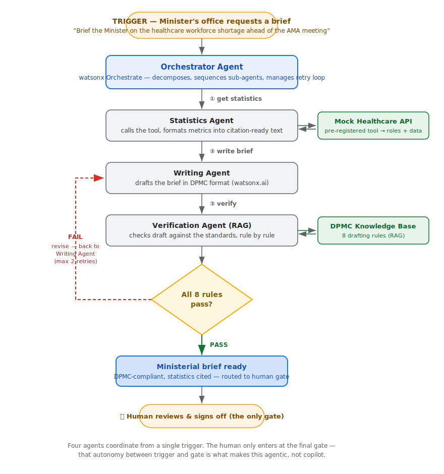

# Chapter 1: Building Agents with watsonx Orchestrate

Welcome to the first chapter of the DEWR Agentic AI Bootcamp! This section introduces **no-code agent building** using watsonx Orchestrate. You'll build a workforce intelligence agent that answers questions about Australian skills shortages, grounded in official Jobs and Skills Australia (JSA) data.

<!-- VIDEO PLACEHOLDER: Intro-Orchestrate — re-insert video embed here -->

## Learning Objectives

By the end of this chapter, you'll be able to:
- Understand what watsonx Orchestrate is and how it works
- Build agents without writing any code
- Integrate tools and knowledge bases into your agents
- Create agentic RAG (Retrieval Augmented Generation) solutions grounded in official government data
- Use external tools like Firecrawl for live web scraping
- Combine two sources to answer questions that neither source could answer alone

## What is watsonx Orchestrate?

watsonx Orchestrate is IBM's no-code platform for building AI-powered agents and automating business processes. It allows you to:
- Create conversational AI agents without programming
- Connect to various data sources and APIs
- Build complex workflows using a visual interface
- Deploy agents that can understand natural language and perform tasks

## The Use Case: Workforce Intelligence

Throughout this lab your agent will reason over two official sources:

| Source | What it provides | How the agent accesses it |
|---|---|---|
| **2025 OSL Key Findings Report (PDF)** | Annual occupation shortage ratings, 2024→2025 trends, top employing occupations in shortage, state and territory breakdowns | Knowledge base (agentic RAG) |
| **JSA Current Skills Shortages (webpage)** | Shortage typology (Longer Training Gap / Shorter Training Gap / Suitability Gap / Retention Gap), Top 20 occupations in demand, regional barriers, wage analysis | Firecrawl web scraping |

- PDF: [2025 OSL Key Findings Report](https://www.jobsandskills.gov.au/sites/default/files/2025-10/2025%20OSL%20Key%20Findings%20Report_0.pdf) (also included in the `1. Orchestrate/` folder)
- Webpage: [JSA Current Skills Shortages](https://www.jobsandskills.gov.au/publications/towards-national-jobs-and-skills-roadmap-summary/current-skills-shortages)

> **Note:** Orchestrate's Firecrawl skill uses `/scrape` only — it fetches a single page per call. There is no multi-page crawling, so always point the agent at the exact page you need.

## Setup Instructions

Before we begin, you'll need:
- Access to a watsonx Orchestrate instance (details provided in class)
- A Firecrawl API key for Exercise C (provided in class)

## Course Exercises

### Exercise A: Basic Agent Interactions

<!-- VIDEO PLACEHOLDER: Orchestrate1-Basic — re-insert video embed here -->

Create an agent with no tools or knowledge attached, and start with these warm-up questions:

1. **"What is a skills shortage, and how do governments typically measure one?"**
   - Tests the agent's general understanding of labour market concepts
   - Observe how the agent structures its response

2. **"What is the difference between a labour shortage and a skills gap?"**
   - Tests precision with closely related terminology
   - Notice whether the agent distinguishes the two cleanly

3. **"How could an ageing population change Australia's labour market over the next decade?"**
   - Complex, open-ended reasoning question
   - Shows the agent's ability to provide structured analysis

**Observation point:** these answers come entirely from the model's training data. They're fluent, but there are no citations and no current figures. The next two exercises fix exactly that.

### Exercise B: Adding Agentic RAG

<!-- VIDEO PLACEHOLDER: Orchestrate2-RAG — re-insert video embed here -->
*📷 Screenshot to be added — knowledge base configuration in Orchestrate.*
<!-- SCREENSHOT PLACEHOLDER — save your capture as docs/assets/images/orchestrate-exercise-b-kb.png, then delete the note above and uncomment:

-->

Now we'll ground the agent in current, official data by uploading the **2025 OSL Key Findings Report** PDF as a knowledge base.

**Knowledge Base Description:**
> This knowledge base covers Jobs and Skills Australia's 2025 Occupation Shortage List (OSL) Key Findings Report. It contains the national occupation shortage ratings for 2025, how shortage rates have changed since 2024, the top employing occupations rated as being in shortage, and shortage breakdowns by state and territory.

**Try these document-only prompts** (only the PDF can answer them):

```
What are the top employing occupations in national shortage in 2025
and how has the overall shortage rate changed from the previous year?
```

```
Which states and territories show the highest occupation shortage
ratings in 2025?
```

**Why these work:** the year-on-year comparison and the top employing occupations list only exist in the PDF — the agent must retrieve from the knowledge base rather than answer from memory.

### Exercise C: External Tool Integration

<!-- VIDEO PLACEHOLDER: Orchestrate3-MCP — re-insert video embed here -->
*📷 Screenshot to be added — Firecrawl tool added to the agent.*
<!-- SCREENSHOT PLACEHOLDER — save your capture as docs/assets/images/orchestrate-exercise-c-firecrawl.png, then delete the note above and uncomment:

-->

Learn to integrate external tools for live web data:

1. **Set up the Firecrawl tool**:
   ```bash
   env FIRECRAWL_API_KEY=your_api_key_here npx -y firecrawl-mcp
   ```

2. **Add the tool**: `Firecrawl:firecrawl_scrape`

3. **Update the agent's instructions** so it knows when to scrape:
   ```
   You help DEWR staff understand Australian skills shortages. You have
   two sources:

   1. A knowledge base containing the 2025 OSL Key Findings Report.
   2. A Firecrawl scrape tool. When a question needs detail from the
      current skills shortages webpage, scrape:
      https://www.jobsandskills.gov.au/publications/towards-national-jobs-and-skills-roadmap-summary/current-skills-shortages

   Always state which source each finding comes from.
   ```

4. **Test with this web-only prompt** (only the webpage can answer it):
   ```
   What are the four types of skills shortages and which occupations
   fall under each category?
   ```

**Why this works:** the shortage typology (Longer Training Gap / Shorter Training Gap / Suitability Gap / Retention Gap) and the Top 20 occupations in demand table only exist on the webpage — not in the PDF.

### Exercise D: Two-Source Reasoning

This is the payoff. These queries can only be answered by **combining** the knowledge base and the scraped webpage — neither source alone is enough:

```
Which occupations have been in persistent shortage since 2021,
and are they still appearing as shortage occupations in the 2025 OSL?
```

```
For Registered Nurses and Electricians, what type of shortage is
driving the problem and what does the 2025 data say about whether
it's improving or worsening?
```

```
Given that wage increases are rarely used to address shortages, what
does the 2025 OSL say about which occupations are most at risk and
what interventions might work for each shortage type?
```

```
Which shortage occupations face the worst regional location barriers,
and are those same occupations still rated as in shortage nationally
in 2025?
```

**Teaching point:** the most powerful agent demos require two-source reasoning. Watch how the agent scrapes the webpage for shortage types and historical persistence, then cross-references the knowledge base for the latest 2025 ratings.

---

# Part 2: From Copilot to Agentic — The Ministerial Brief Agent

Everything you built in Part 1 was a **copilot**: a capable assistant that answered when you asked. You grounded it in enterprise data with a knowledge base (Exercise B) and extended what it could do with a tool (Exercise C) — the two fundamentals of any useful agent. But *you* drove every step.

Part 2 crosses the line into **agentic**. Instead of you prompting each step, a single trigger starts a system of three agents that plan and act across tools to complete the job — only handing back to a human at the final sign-off gate.

## Copilot vs Agentic

This is the core distinction to take away from today:

| Copilot (Part 1) | Agentic (Part 2) |
|---|---|
| A human prompts each step | A trigger starts the whole process |
| One tool per interaction | Multiple tools and agents in sequence |
| AI suggests, the human acts | AI gathers data, drafts, and routes |
| Human stays in the loop at every step | Human only reviews at a gate |
| Runs when asked | Runs on a schedule or event |

Put simply: **a copilot is an individual assistant; an agent reacts, reasons, and acts.** The knowledge base grounds the model in your enterprise data; a tool gives the model new capabilities; agentic design lets the model *use* those things autonomously to complete a job end to end.

## The Use Case

- **Persona:** Policy Analyst
- **Trigger:** the Minister's office requests a brief
- **Scenario:** *"Brief the Minister on the current state of the healthcare workforce shortage ahead of the meeting with the AMA (Australian Medical Association)."*
- **Outcome:** a ministerial brief with cited statistics, produced autonomously in the Department's standard format, ready to route for sign-off.

## The Three-Agent Architecture



| Agent | Role |
|---|---|
| **Orchestrator** | Decomposes the request and sequences the two sub-agents |
| **Statistics Agent** | Calls the healthcare workforce tool and formats the metrics into citation-ready text |
| **Writing Agent** | Drafts the brief in the Department's standard format, grounded in a knowledge base that defines that format |

**Key design decision:** the brief format isn't hard-coded into the prompt — it lives in a **knowledge base document** the Writing Agent draws on. That keeps the prompt short and lets you change the house style by editing one document rather than re-engineering the agent. It's the same grounding principle you used in Exercise B (knowledge base) and Exercise C (tool), now combined in one autonomous flow.

## What's Provided vs. What You'll Build

This is a guided-assembly lab. The scaffolding is pre-built so you spend the hour wiring and running, not authoring from scratch:

**Provided** (in `1. Orchestrate/Ministerial Brief Agent/`):
- **`healthcare-workforce-openapi.yaml`** — an OpenAPI spec you import as the Statistics Agent's data tool
- **`Ministerial Brief Format.docx`** — the brief format and rules, uploaded as the Writing Agent's knowledge base
- **`Agent Prompts.md`** — the three agent prompts and descriptions, ready to paste

**You'll build:** import the data tool, upload the format knowledge base, create the three agents, wire the orchestrator, and run the AMA scenario.

### The healthcare data tool

A single endpoint returns all healthcare roles with monthly employment numbers and a sector summary — for example: 48% of healthcare occupations in national shortage, Registered Nurses at 312,400 (down 1,200 on the month), retention gap as the primary driver, regional fill rates (62.9%) lagging metro (69.7%). All figures are illustrative mock data, clearly labelled, and easy to swap for a real ABS/JSA feed later. (A self-contained Python version, `healthcare_workforce_tool.py`, is included as a no-hosting fallback.)

### The brief format (knowledge base)

The Writing Agent grounds its formatting in `Ministerial Brief Format.docx`, which defines the required structure and rules:

1. **Purpose** — one sentence starting with "To inform", "To advise", or "To seek approval"
2. **Key points** — maximum 5 bullets
3. **Citations** — every statistic cites source and period, e.g. "(JSA Occupation Shortage List 2025)"
4. **Financial implications** — section required, even if "No direct financial implications"
5. **Classification** — OFFICIAL or OFFICIAL: Sensitive marking at the top
6. **Background** — 300 words or fewer
7. **Contact officer** — name, title, phone, and date at the end
8. **Action type** — "For Noting" or "For Decision/Approval"

> This format is an **illustrative teaching stand-in**, not official Australian Government policy.

## Build Steps (guided assembly)

1. **Statistics Agent** — create the agent, import `healthcare-workforce-openapi.yaml` as its data tool, paste its prompt, and test that it returns the workforce figures as cited text.
2. **Writing Agent** — create the agent, upload `Ministerial Brief Format.docx` as its knowledge base, and paste its prompt.
3. **Orchestrator** — create the agent, connect it to the two sub-agents, and paste its prompt.

All three prompts and descriptions are in `Agent Prompts.md`.

## Run It: The AMA Scenario

Trigger the Orchestrator with:

```
Brief the Minister on the current state of the healthcare workforce shortage
ahead of the meeting with the AMA (Australian Medical Association).
```

Then watch the system work on its own: the Orchestrator calls the Statistics Agent (① data), then passes the figures to the Writing Agent (② draft), which formats the brief against the knowledge base and hands the finished brief back for sign-off. You triggered it once; the agents did the rest.

> **Teaching note:** point out that no human prompted the individual steps. One request fanned out into a data lookup and a grounded draft, and came back as a finished brief. That hands-off run between the trigger and the sign-off gate is exactly what separates an agentic system from a copilot.

## Example Output

```
OFFICIAL: Sensitive

BRIEF TO THE MINISTER
Employment and Workplace Relations

SUBJECT: Healthcare workforce shortage — background for AMA meeting

PURPOSE: To inform the Minister of current healthcare workforce conditions
ahead of the meeting with the Australian Medical Association.

KEY POINTS:
• 48% of healthcare occupations are in national shortage
  (JSA Occupation Shortage List 2025)
• Registered Nurses most acute: 312,400 employed April 2026, down 1,200 from March
• Retention gap is the primary driver — workers leaving faster than training
  pipelines can replace
• Regional fill rates (62.9%) lag metro (69.7%)

BACKGROUND: ...

FINANCIAL IMPLICATIONS: No direct financial implications.

ACTION: For Noting

Contact: [Name] | [Title] | [Phone] | April 2026
```

## What Just Happened

You started a process with one request and a system of agents completed it — gathering data, then drafting against a documented standard — handing back a finished, formatted brief for you to sign off. The human entered once, at the gate. That is the shift from copilot to agentic, and it's the foundation the rest of this course builds on.

## Suggested 60-Minute Timing

| Time | Activity |
|---|---|
| 0–10 | Concept: copilot vs agentic; walk the architecture diagram |
| 10–18 | Inspect the provided data tool and the brief format document |
| 18–32 | Build and test the Statistics Agent (import the OpenAPI tool) |
| 32–46 | Build the Writing Agent (upload the format knowledge base) |
| 46–55 | Wire the Orchestrator; run the AMA scenario end to end |
| 55–60 | Review the brief at the gate; debrief |

## Essential Resources

- [Getting Started Tutorial](https://www.ibm.com/docs/en/watsonx/watson-orchestrate/base?topic=getting-started-watsonx-orchestrate) - Official IBM documentation
- [Agent Development Kit (ADK)](https://developer.watson-orchestrate.ibm.com/) - Deep dive into advanced development features

## Key Concepts

### No-Code Development
- **Visual Interface**: Build agents using drag-and-drop components
- **Natural Language**: Configure agents using plain English descriptions
- **Pre-built Integrations**: Connect to popular business applications without coding

### Agentic RAG
- **Knowledge Integration**: Add custom knowledge bases to your agents
- **Context-Aware Responses**: Agents provide answers based on your specific documents
- **Grounded Answers**: Responses cite current official data rather than training data

### Tool Integration
- **External APIs**: Connect to web services and databases
- **Real-time Data**: Access current information from live sources
- **Two-Source Reasoning**: Combine a knowledge base and a live tool to answer questions neither could alone

## Practice Exercises

1. **Employment Data Digest**:
   - Point Firecrawl at the [ABS Labour Force latest release](https://www.abs.gov.au/statistics/labour/employment-and-unemployment/labour-force-australia/latest-release)
   - Ask the agent to produce key statistics for program managers

2. **Labour Market Policy Briefer**:
   - Ask the agent for a three-paragraph Ministerial briefing combining the OSL knowledge base and the scraped webpage
   - Check whether each claim is attributed to the right source

3. **Occupation Shortage Explainer for Employers**:
   - Ask for a plain-English explainer an employer could read in two minutes
   - Compare how the agent simplifies the shortage typology

## Next Steps

Once you've mastered no-code agent building with Orchestrate, you're ready to move on to:

**[Chapter 2: Langflow](langflow)** - Learn visual, low-code agent development

---

## Related Files

All the code and resources for this chapter can be found in:
```
1. Orchestrate/
├── README.md                                 # Lab reference guide
├── 2025 OSL Key Findings Report.pdf          # Part 1 knowledge base document
└── Ministerial Brief Agent/                  # Part 2 agentic use case
    ├── Ministerial Brief Format.docx         # Writing Agent knowledge base (format + rules)
    ├── healthcare-workforce-openapi.yaml     # Statistics Agent data tool (OpenAPI)
    ├── healthcare_workforce_tool.py          # No-hosting Python fallback for the tool
    ├── DPMC Brief Standards.md               # Text version of the brief format
    └── Agent Prompts.md                      # The three agent prompts and descriptions
```
